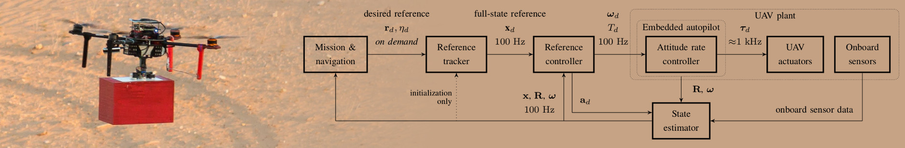

# The MRS UAV system core



| UAV core build status | [](https://travis-ci.com/ctu-mrs/uav_core) | [](https://travis-ci.com/ctu-mrs/uav_core) |
|-----------------------|---------------------------------------------------------------------------------------------------------------------------------------------------|-------------------------------------------------------------------------------------------------------------------------------------------------|

| ROS Package                                                             | 18.04 Bionic                                                                                                                                                              | 20.04 Focal                                                                                                                                                             |
|-------------------------------------------------------------------------|---------------------------------------------------------------------------------------------------------------------------------------------------------------------------|-------------------------------------------------------------------------------------------------------------------------------------------------------------------------|
| [mrs_bumper](https://github.com/ctu-mrs/mrs_bumper)                     | [](https://travis-ci.com/ctu-mrs/mrs_bumper)                     | [](https://travis-ci.com/ctu-mrs/mrs_bumper)                     |
| [mrs_lib](https://github.com/ctu-mrs/mrs_lib)                           | [](https://travis-ci.com/ctu-mrs/mrs_lib)                           | [](https://travis-ci.com/ctu-mrs/mrs_lib)                           |
| [mrs_mavros_interface](https://github.com/ctu-mrs/mrs_mavros_interface) | [](https://travis-ci.com/ctu-mrs/mrs_mavros_interface) | [](https://travis-ci.com/ctu-mrs/mrs_mavros_interface) |
| [mrs_msgs](https://github.com/ctu-mrs/mrs_msgs)                         | [](https://travis-ci.com/ctu-mrs/mrs_msgs)                         | [](https://travis-ci.com/ctu-mrs/mrs_msgs)                         |
| [mrs_optic_flow](https://github.com/ctu-mrs/mrs_optic_flow)             | [](https://travis-ci.com/ctu-mrs/mrs_optic_flow)             | [](https://travis-ci.com/ctu-mrs/mrs_optic_flow)             |
| [mrs_rviz_plugins](https://github.com/ctu-mrs/mrs_rviz_plugins)         | [](https://travis-ci.com/ctu-mrs/mrs_rviz_plugins)         | [](https://travis-ci.com/ctu-mrs/mrs_rviz_plugins)         |
| [mrs_uav_controllers](https://github.com/ctu-mrs/mrs_uav_controllers)   | [](https://travis-ci.com/ctu-mrs/mrs_uav_controllers)   | [](https://travis-ci.com/ctu-mrs/mrs_uav_controllers)   |
| [mrs_uav_general](https://github.com/ctu-mrs/mrs_uav_general)           | [](https://travis-ci.com/ctu-mrs/mrs_uav_general)           | [](https://travis-ci.com/ctu-mrs/mrs_uav_general)           |
| [mrs_uav_managers](https://github.com/ctu-mrs/mrs_uav_managers)         | [](https://travis-ci.com/ctu-mrs/mrs_uav_managers)         | [](https://travis-ci.com/ctu-mrs/mrs_uav_managers)         |
| [mrs_uav_odometry](https://github.com/ctu-mrs/mrs_uav_odometry)         | [](https://travis-ci.com/ctu-mrs/mrs_uav_odometry)         | [](https://travis-ci.com/ctu-mrs/mrs_uav_odometry)         |
| [mrs_uav_status](https://github.com/ctu-mrs/mrs_uav_status)             | [](https://travis-ci.com/ctu-mrs/mrs_uav_status)             | [](https://travis-ci.com/ctu-mrs/mrs_uav_status)             |
| [mrs_uav_testing](https://github.com/ctu-mrs/mrs_uav_testing)           | [](https://travis-ci.com/ctu-mrs/mrs_uav_testing)           | [](https://travis-ci.com/ctu-mrs/mrs_uav_testing)           |
| [mrs_uav_trackers](https://github.com/ctu-mrs/mrs_uav_trackers)         | [](https://travis-ci.com/ctu-mrs/mrs_uav_trackers)         | [](https://travis-ci.com/ctu-mrs/mrs_uav_trackers)         |

## System requirements

Required OS is Ubuntu 18.04 / 20.04 LTS 64-bit or their flavors that can install ROS Melodic / Noetic.
The suggested variant of OS installation is dual boot instead of virtualization that can be slow and can not handle well the simulation GUI.
We use [Gitman](https://github.com/jacebrowning/gitman) to manage the repository **submodules**.
The repository are supposed to be compiled by [catkin tools](https://catkin-tools.readthedocs.io).

## Installing uav_core

The preferred way is to install the whole [MRS UAV system](https://github.com/ctu-mrs/mrs_uav_system).
However, if you prefer to install only the *uav_core*, you can do the following:

1. Clone the repository,
2. place it into your *catkin workspace*,
3. call ```installation/install.sh``` to install the dependencies,
4. build your workspace.

## Finishing your .bashrc

The `install.sh` script will add the following to your .bashrc:
```bash
source /opt/ros/melodic/setup.bash

# source uav_core shell additions
source $HOME/git/uav_core/miscellaneous/shell_additions/shell_additions.sh
export UAV_NAME="uav1" 
export NATO_NAME="" # lower-case name of the UAV frame {alpha, bravo, charlie, ...}
export UAV_MASS="3.0" # [kg], used only with real UAV
export RUN_TYPE="simulation" # {simulation, uav}
export UAV_TYPE="f550" # {f550, f450, t650, eagle, naki}
export PROPULSION_TYPE="default" # {default, new_esc, ...}
export ODOMETRY_TYPE="gps" # {gps, optflow, hector, vio, ...}
export INITIAL_DISTURBANCE_X="0.0" # [N], external disturbance in the body frame
export INITIAL_DISTURBANCE_Y="0.0" # [N], external disturbance in the body frame
export STANDALONE="false" # disables the core nodelete manager
export SWAP_GARMINS="false" # swap up/down garmins
export PIXGARM="false" # true if Garmin lidar is connected throught Pixhawk
export SENSORS="" # {garmin_down, garmin_up, rplidar, realsense_front, teraranger, bluefox_optflow, realsense_brick, bluefox_brick}
export WORLD_NAME="simulation" # e.g.: "simulation" <= mrs_general/config/world_simulation.yaml
export MRS_STATUS="readme" # {readme, dynamics, balloon, avoidance, control_error, gripper}
export LOGGER_DEBUG="false" # sets the ros console output level to debug
```

Our shell additions
```source $HOME/git/uav_core/miscellaneous/shell_additions/shell_additions.sh```
provide some useful command line aliases (git, catkin, cd) and some neccessary shell functions (wait\* commands for simulation).

All the environment variables define a particular configuration of a UAV (through launch files).
The variables apply mostly to real hardware. They allow us to make the **core** universal without the need of hardcoding configurations for a particular UAV, but only for a UAV type.
In a simulation, they are mostly *overloaded* in each tmuxinator session.

## The `cd` alias

One of the features of our [shell_additions.sh](https://github.com/ctu-mrs/uav_core/blob/master/miscellaneous/shell_additions/shell_additions.sh) that might be intrusive is our `cd` alias.
Our `cd` is capable of automatically traversing from locations that have been symlinked somewhere, to the linked location.
This is especially useful if you (like us) clone git repositories under a specific location, e.g., `~/git/my_repository` and then link them to catkin workspaces, e.g., `~/project2_workspace/src/my_repository`.
When you call
```bash
cd ~/git/my_repository
```
our alias will put you in
```bash
user@machine:~/project2_workspace/src/my_repository$ 
```

A symlink map (stored in `/tmp/symlink_array.sh`) for all your workspaces is built automatically after boot (after the first start of the terminal) by a detached tmux session using the *silversearcher-ag* utility.
Only the workspaces in the environment variable
```bash
export ROS_WORKSPACES="~/mrs_workspace ~/modules_workspace ~/workspace ~/project2_workspace"
```
are considered.
The `ROS_WORKSPACES` variable is added during the installation of [MRS UAV system](https://github.com/ctu-mrs/mrs_uav_system) since that is where we set up the workspaces for you.
